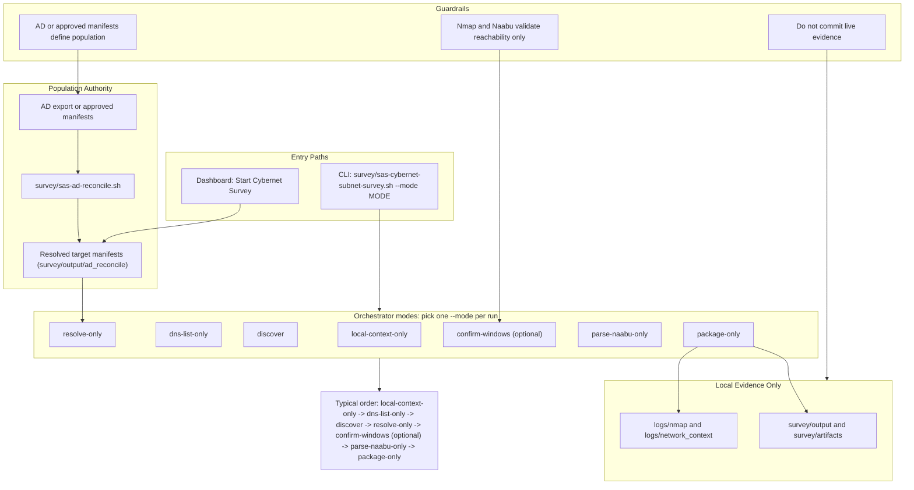

# Start Here: Cybernet / Neuron Network Survey

This is the current priority field workflow for SysAdminSuite technicians.

Use it when you need to locate Cybernet or Neuron devices from approved deployment documentation using a local admin workstation, target manifests, and conservative approved network discovery.

## Workflow at a glance

Use this diagram to keep the field path straight: approved population first, local context and reachability second, local evidence package last. Mermaid source: [`docs/diagrams/cybernet-neuron-survey-flow.mmd`](docs/diagrams/cybernet-neuron-survey-flow.mmd).

Each orchestrator mode is a separate `--mode` run, not a single chained pipeline. The numbered order below is the typical progression, but you invoke one mode at a time.



## Dashboard quick path

Use the Cybernet-first dashboard when you want a guided wizard instead of memorizing CLI steps. Live Mode is **not** the front door — it lives under **Advanced Tools → Generate Survey Commands**.

1. **Open the dashboard** — double-click [`START-HERE-SysAdminSuite-Dashboard.bat`](START-HERE-SysAdminSuite-Dashboard.bat) at the repo root. This starts the local host and opens `http://127.0.0.1:5000/dashboard/?tutorial=setup`; from there click **Start Cybernet Survey**. For a direct survey deep link, use [`Start-CybernetSurveyTutorial.cmd`](Start-CybernetSurveyTutorial.cmd). See [`START-HERE-SysAdminSuite.md`](START-HERE-SysAdminSuite.md) and [`docs/DASHBOARD_ENTRYPOINT.md`](docs/DASHBOARD_ENTRYPOINT.md).
2. **Start Cybernet Survey** — opens the wizard (progress rail: Start → Load targets → Network posture → Identity evidence → Reachability → Review results).
3. **Copy posture and identity commands** — run network preflight and workstation identity on the admin box; keep output local.
4. **Optional reachability** — wizard step 4 is skippable; uses profile `keyports_cybernet_json` when you need low-noise port confirmation.
5. **Load Evidence** — drop `network_preflight.csv`, `workstation_identity.csv`, optional reachability JSON, normalized target manifests, and AD population CSVs.
6. **Review Results** — use the Cybernet review summary; open **Advanced Tools** only for detailed panels or legacy command generation.

For subnet discovery and Nmap orchestration, use the CLI path below.

## AD-first warning

**Active Directory registered population is the population authority.** When an authorized AD computer export is available, reconcile AD before building scan candidate lists.

1. Place the approved export locally (do not commit live CSVs). Use `targets/local/` or `logs/targets/` per [`docs/TARGETS_FOLDER_POLICY.md`](docs/TARGETS_FOLDER_POLICY.md).
2. Run `bash survey/sas-ad-reconcile.sh --ad-csv <local-export.csv> --output-dir survey/output/ad_reconcile/<run-id>`.
3. Use `ad_targets_hostnames.txt` and `ad_evidence_matches.csv` to drive manifests and downstream validation.
4. Treat Naabu/Nmap as **reachability validation only** against AD-derived targets — not as the population source.

See [`docs/AD_REGISTERED_POPULATION.md`](docs/AD_REGISTERED_POPULATION.md) and [`docs/AD_CYBERNET_EXPORT_CONTRACT.md`](docs/AD_CYBERNET_EXPORT_CONTRACT.md).

## Urgent path (orchestrator)

Use one correlated `--site` and `--run-id` across steps:

```bash
SITE=nsuh
RUN_ID="$(date +%Y%m%d_%H%M%S)"
SUBNET_FILE=survey/output/local_subnet_finder/${SITE}_${RUN_ID}/subnet_candidates.txt
MANIFEST=survey/output/cybernet_targets_resolved.csv
HOSTS=survey/output/cybernet_subnet_survey/${SITE}_${RUN_ID}/hosts/10_10_10_0_24_up.txt
```

```bash
# 1. Local subnet finder + network context
bash survey/sas-cybernet-subnet-survey.sh --site "$SITE" --run-id "$RUN_ID" --mode local-context-only

# 2. DNS/list sanity check (not host proof)
bash survey/sas-cybernet-subnet-survey.sh --site "$SITE" --run-id "$RUN_ID" --mode dns-list-only --subnet-file "$SUBNET_FILE"

# 3. Nmap -sn discovery (no-DNS + system-DNS)
bash survey/sas-cybernet-subnet-survey.sh --site "$SITE" --run-id "$RUN_ID" --mode discover --subnet-file "$SUBNET_FILE"

# 4. Resolve manifest against Nmap XML evidence
bash survey/sas-cybernet-subnet-survey.sh --site "$SITE" --run-id "$RUN_ID" --mode resolve-only --manifest "$MANIFEST"

# 5. Optional Windows port confirmation (small AD-derived or discovery host list)
# Prefer logs/targets/<site>_confirm_hosts.txt for Phase 2b reachability (not subnet-wide discovery)
bash survey/sas-cybernet-subnet-survey.sh --site "$SITE" --run-id "$RUN_ID" --mode confirm-windows \
  --confirm-tool naabu --host-file "$HOSTS" --pipe-followup

# 6. Package local artifacts
bash survey/sas-cybernet-subnet-survey.sh --site "$SITE" --run-id "$RUN_ID" --mode package-only --manifest "$MANIFEST"
```

Windows double-click launcher (Git Bash on PATH):

```bat
survey\sas-cybernet-subnet-survey.cmd --site nsuh --mode local-context-only
```

## Need subnets first (standalone)

Run this from Git Bash/MSYS2 Bash on the connected admin workstation:

```bash
bash survey/sas-find-local-subnets.sh --site <site-code>
```

Example:

```bash
bash survey/sas-find-local-subnets.sh --site nsuh
```

The command produces:

- `survey/output/local_subnet_finder/<site>_<timestamp>/subnet_candidates.txt`
- `survey/output/local_subnet_finder/<site>_<timestamp>/subnet_candidates.csv`
- local context under `context/`
- `SUMMARY.md`

Use `subnet_candidates.txt` as the fast approved CIDR shortlist for the rest of the survey workflow.

## Full fast path

1. Read the full tutorial: [`docs/tutorials/CYBERNET_NEURON_NETWORK_SURVEY.md`](docs/tutorials/CYBERNET_NEURON_NETWORK_SURVEY.md)
2. Put approved local target CSVs in `survey/input/`
3. Run `bash tests/bash/smoke-bash-windows-runtime.sh`
4. Run the orchestrator steps above (or individual scripts documented in the tutorial)
5. Build manifests with `bash survey/sas-survey-targets.sh`
6. Contract tests: `bash tests/bash/test-cybernet-subnet-survey-contracts.sh`

## Low-noise survey discipline

This workflow follows low-noise survey discipline (authorized, scoped, no-target-mutation,
local evidence only). The subnet orchestrator path above is for discovery context; it is
**not** the registered Cybernet population source. For Phase 2b reachability confirmation,
prefer an AD-derived host list placed in the local gitignored `logs/targets/` store and
validate reachability against that list only. See
[`docs/LOW_NOISE_SURVEY_DOCTRINE.md`](docs/LOW_NOISE_SURVEY_DOCTRINE.md).

## Evidence notes

- **Nmap** helps find live hosts, DNS names, MACs on local L2, and XML evidence for resolver tooling.
- **Serial matching** comes from manifests, trackers, AD/CMDB exports, or approved identity probes — not from Nmap alone.
- **Naabu** is only for narrow port reachability confirmation against already-small candidate host lists.

## Hard rules

- Do not commit live target CSVs, scan output, dashboards, ZIPs, serials, MACs, or site evidence.
- Do not run broad scans without approved scope.
- Do not use spoofing, decoys, stealth flags, vuln scripts, brute force, or credential attacks.
- Do not claim Nmap found a serial unless an approved serial evidence source actually produced it.

This workflow is for asset discovery and reconciliation. Keep it boring, clean, and provable.
