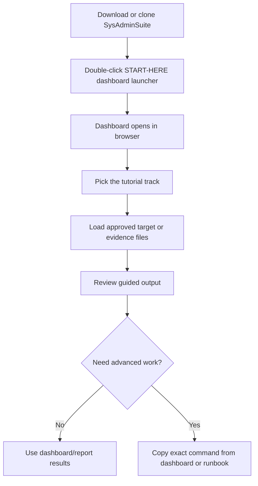

# Start Here — SysAdminSuite

You do **not** need to memorize command-line tools to use SysAdminSuite.

## "Am I supposed to get a set of code to run?"

No. For most users, do not start with command-line tools.

Double-click:

`START-HERE-SysAdminSuite-Dashboard.bat`

This opens the local dashboard and tutorial page.

Use CLI tools only when the dashboard or a runbook gives you a specific command.

## How do I download SysAdminSuite?

Choose the parent folder where you want SysAdminSuite to live (for example, your Desktop or a `dev` folder).

Run:

```bash
git clone https://github.com/EndeavorEverlasting/SysAdminSuite.git
```

This creates the `SysAdminSuite` folder.

Then open the `SysAdminSuite` folder and double-click:

`START-HERE-SysAdminSuite-Dashboard.bat`

**Do not** create a `SysAdminSuite` folder first and then clone inside it. That can create `SysAdminSuite\SysAdminSuite` and the launcher will not be at the top level where you expect it.

No Git? Use the green **Code** button on the GitHub page, choose **Download ZIP**, then extract it. The extracted folder contains `START-HERE-SysAdminSuite-Dashboard.bat`.

## I just downloaded or cloned the repo. What do I click?

Double-click **`START-HERE-SysAdminSuite-Dashboard.bat`** at the repo root.

That is the one file to start. (`START-HERE-SysAdminSuite-Dashboard.cmd` and `SysAdminSuite Dashboard.cmd` are compatibility aliases that do the same thing if your site prefers a `.cmd` shortcut — but the `.bat` is the documented front door.)

**Shortcut tip:** Right-click `START-HERE-SysAdminSuite-Dashboard.bat` → **Send to** → **Desktop (create shortcut)**.

## What opens?



1. A small dashboard host starts on your computer (look for a tray icon near the clock).
2. Your browser opens the local dashboard at:

   `http://127.0.0.1:5000/dashboard/?tutorial=setup`

3. The browser tab shows the Harold icon. Follow **Repo Setup** first, then click **Start Cybernet Survey** for field survey work.

On first run, the launcher may **automatically prepare the dashboard app** for a minute before the browser opens. If Microsoft .NET 8 dependencies are missing, it can download official Microsoft installers, verify them, and build the local dashboard host. You do not need to run any command yourself.

### Source clone vs field release package

| You have | Do this |
|----------|---------|
| Git + internet/admin approval for Microsoft installers | Clone the repo, double-click `START-HERE-SysAdminSuite-Dashboard.bat` |
| Locked-down PC where downloads or installs are blocked | Get the **field release ZIP** — see [`docs/DASHBOARD_FIELD_RELEASE.md`](docs/DASHBOARD_FIELD_RELEASE.md) — extract it, then double-click the `.bat` |

No internet is required after the dashboard dependencies are installed or the field release package is extracted. Bootstrap details: [`docs/DASHBOARD_DEPENDENCY_BOOTSTRAP.md`](docs/DASHBOARD_DEPENDENCY_BOOTSTRAP.md).

## How do updates work?

Updates are opt-in. If this is a git clone, the launcher can offer to fast-forward
clean `main` from `origin/main`. If this is a ZIP or field package, updates come
from a checksum-verified package manifest. In both cases, you approve before
anything changes. See [`docs/APPROVED_UPDATE_FLOW.md`](docs/APPROVED_UPDATE_FLOW.md).

## Repair / refresh my copy

If a tech needs to make the local copy match official `origin/main`, run the
field repair updater instead of typing raw Git commands:

```powershell
powershell.exe -NoProfile -ExecutionPolicy Bypass -File .\Update-SysAdminSuite.ps1
```

If your SysAdminSuite folder is not `%USERPROFILE%\Desktop\SysAdminSuite`, pass
the actual folder with `-InstallRoot`. The updater prints the target path and
requires `Type YES to update` before it repairs the repo.

Do not run `git clone` over an existing copy. The updater handles the three safe
cases: clone when the folder is missing, back up an existing non-git folder, or
repair an existing Git repo.

Important: the repair updater runs `git reset --hard origin/main` and
`git clean -fd` inside the SysAdminSuite repo. That makes the local copy match
official `main`, and local edits inside the repo are discarded. See
[`docs/FIELD_TECH_UPDATE.md`](docs/FIELD_TECH_UPDATE.md).

## What if the dashboard does not open?

1. Run `START-HERE-SysAdminSuite-Dashboard.bat` from the **repo root**, not from inside a subfolder.
2. The window will not close on its own — read any message it prints, then press a key to close it.
3. Paste into your browser: `http://127.0.0.1:5000/dashboard/?tutorial=setup`
4. The launcher tries to prepare the dashboard app automatically. If it reports that dependency download, Microsoft .NET installation, or build preparation failed, ask for the packaged SysAdminSuite Dashboard release or have IT/admin prepare the workstation. You should not run the build command yourself.
5. Read [`docs/DASHBOARD_ENTRYPOINT.md`](docs/DASHBOARD_ENTRYPOINT.md) for IT troubleshooting.

## What about an EXE?

The repo does **not** ship a committed `.exe` today. Field users should use the `.bat` launcher above.

A future sprint will document shipping or building `SysAdminSuite Dashboard.exe` for shortcut-friendly desktops. See [`docs/DASHBOARD_EXE_FUTURE_SPRINT.md`](docs/DASHBOARD_EXE_FUTURE_SPRINT.md).

Developers / IT can build a local `.exe` now:

```powershell
powershell.exe -NoProfile -ExecutionPolicy Bypass -File tools\publish-dashboard-entrypoint.ps1
```

Output: `dist/SysAdminSuiteDashboard/SysAdminSuite Dashboard.exe` (gitignored, built on your machine only).

## When do I use CLI commands?

Only when the dashboard tells you to copy a command, or a runbook explicitly asks for Bash survey steps. CLI commands are optional and specific — they are not the default front door.

## Tutorial: check workstations for AutoLogon status

Use this workflow when you need to determine whether approved workstations are configured for AutoLogon. The assessment is **read-only**. It checks workstation and directory evidence but does not install AutoLogon, modify the registry, or prove that a human technician performed the change.

### Before you begin

You need:

1. An authorized admin workstation with the current SysAdminSuite repo.
2. Git Bash on Windows for the primary command path.
3. An approved target list stored locally, not committed to git.
4. Network and administrative access to the target workstations.
5. AD read access only when you use `--ad-live`.

Create a CSV under `targets/local/`, for example `targets/local/autologon-check.csv`:

```csv
HostName
WORKSTATION001
WORKSTATION002
```

Do not put real target lists in `targets/sanitized/` or commit them.

### Run the check

Open Git Bash in the SysAdminSuite repo root and run:

```bash
bash survey/sas-assess-autologon.sh \
  --manifest ./targets/local/autologon-check.csv \
  --preflight \
  --ad-live \
  --output ./survey/output/autologon_assessment.csv \
  --dashboard ./survey/output/autologon_dashboard.html \
  --open
```

The command performs a bounded readiness check, reads the AutoLogon-related registry posture, optionally checks the matching AD user and computer OU, writes local evidence, and opens an HTML report.

### Read the result

Use the `OverallStatus` column in the CSV or the status shown in the HTML dashboard:

| Status | What it means | Operator action |
|---|---|---|
| `autologon_ready` | Intent, Winlogon settings, AD user, and OU evidence align. | Record the workstation as configuration-ready, then use a controlled reboot and direct observation when runtime proof is required. |
| `shared_device` | The PostInstall AutoLogon intent marker is absent. | Confirm whether the workstation is supposed to receive AutoLogon before requesting installation. |
| `intent_only` | AutoLogon intent exists, but Winlogon setup is not complete. | Route for installation or remediation. |
| `setup_incomplete` | Winlogon values do not match the expected workstation identity. | Stop expansion and review the workstation. |
| `account_missing` | The expected AD user was not found. | Resolve the directory account dependency before installation. |
| `ou_mismatch` | The computer is not in the expected managed shared-workstation OU. | Correct or approve the OU posture before installation. |
| `unreachable` | The host or admin share could not be reached. | Do not infer status. Fix connectivity or access and rerun only that target. |
| `probe_failed` | The workstation was reachable but registry evidence could not be read. | Review permissions and the reported probe error. |

`autologon_ready` is configuration evidence, not complete runtime proof. When a successful automatic sign-in must be demonstrated, reboot an approved pilot workstation and directly observe the sign-in behavior.

### Break-glass local check

Use this only when remote access is unavailable and you are physically at the workstation:

```bash
bash survey/sas-assess-autologon.sh \
  --local \
  --output ./survey/output/autologon_local.csv \
  --open
```

### Evidence and safety

The live CSV and HTML files stay under `survey/output/` on the admin workstation. They can contain real hostnames, usernames, and OU paths. Do not commit or attach them to a public issue or PR.

Full evidence contract and status logic: [`docs/AUTOLOGON_ASSESSMENT.md`](docs/AUTOLOGON_ASSESSMENT.md).

## Tutorial: install approved software from the server

Use this workflow only for approved software, approved targets, and an authorized change or request. The canonical installer is `scripts/Invoke-SasSoftwareInstall.ps1`.

The approved software source list is controlled by `harness/api/sas-harness-api.json`. The initial approved root is:

```text
\\nt2kwb972sms01\
```

The installer path you provide must be **relative** to that root. Do not embed credentials, use an unapproved server, or copy installer packages into the repo.

### Before you begin

Confirm all of the following:

1. You have the approved package name and the exact relative installer path on the server.
2. You have vendor-supported silent arguments for that exact installer version.
3. The target list is authorized and contains no more than 25 workstations.
4. Your admin session can create the required Windows remote session to the target.
5. The software request, change, or ticket authorizes target mutation.
6. You will start with one approved pilot workstation.

A target CSV may use `ComputerName`, `Hostname`, or `Target` as its column name:

```csv
ComputerName
WORKSTATION001
```

Store it under `targets/local/`, for example `targets/local/software-pilot.csv`.

### Step 1: request-only dry run

Open PowerShell in the SysAdminSuite repo root. Replace the example package path and arguments with the approved values:

```powershell
.\scripts\Invoke-SasSoftwareInstall.ps1 `
  -TargetsCsv .\targets\local\software-pilot.csv `
  -PackageName 'ApprovedVendorTool' `
  -InstallerRelativePath 'packages\ApprovedVendorTool\setup.exe' `
  -InstallerArguments @('/quiet', '/norestart') `
  -InstallMode UncDirect `
  -WhatIf
```

`-WhatIf` validates the request and writes local planning evidence. It does **not** contact the installer share, open a remote session, copy a payload, or start the installer.

Review the generated folder under:

```text
survey/output/software_install/<run_id>/
```

Check `software_install_summary.json` and `operator_handoff.txt`. Verify the target count, package name, relative path, mode, and planned status before moving to execution.

### Step 2: approved pilot execution

After the dry run is reviewed, run the same request with the explicit mutation gate. Leave confirmation enabled for the first pilot:

```powershell
.\scripts\Invoke-SasSoftwareInstall.ps1 `
  -TargetsCsv .\targets\local\software-pilot.csv `
  -PackageName 'ApprovedVendorTool' `
  -InstallerRelativePath 'packages\ApprovedVendorTool\setup.exe' `
  -InstallerArguments @('/quiet', '/norestart') `
  -InstallMode UncDirect `
  -AllowTargetMutation
```

PowerShell asks for confirmation before each target. Confirm only the approved pilot target.

`UncDirect` is the preferred mode because SysAdminSuite does not stage the installer on the target. Use `CopyThenInstall` only when direct UNC execution is not practical and the change owner accepts the temporary staging and cleanup risk.

### Step 3: review the evidence

Each run writes admin-box evidence similar to:

```text
survey/output/software_install/<run_id>/
  software_install_events.jsonl
  software_install_summary.json
  operator_handoff.txt
```

Review these fields in `software_install_summary.json`:

| Field | Acceptable pilot result |
|---|---|
| `completed_count` | `1` for a one-target successful pilot |
| `failed_count` | `0` |
| `cleanup_failure_count` | `0` |
| `repo_artifact_remaining_count` | `0` |
| target `status` | `completed` |
| target `exit_code` | `0` |

A nonzero installer exit code is treated as a failure by the current wrapper. Review the vendor's exit-code documentation before retrying or deciding that a reboot code represents success.

### Step 4: verify the installed result

The SysAdminSuite summary proves what the wrapper attempted and what the installer returned. It does not replace application-specific verification. Use the approved detection method for the package, such as a known executable version, an uninstall-registry entry, a service state, or the vendor's own validation command.

Do not expand beyond the pilot until:

1. the wrapper summary is clean;
2. the software-specific detection passes;
3. no SysAdminSuite-owned staging remains on the target;
4. any required reboot behavior is understood;
5. the change owner approves the next batch.

### Stop conditions

Stop and review instead of retrying broadly when:

- the server path is rejected as unapproved;
- the relative path contains `..` or resolves outside the approved root;
- the installer cannot be read from the target context;
- remote session creation fails;
- the installer times out or returns a nonzero exit code;
- cleanup fails or `repo_artifact_remaining_count` is greater than zero;
- the target list or package details differ from the approved request.

The installer does not clear Windows logs, suppress monitoring, collect credentials, create hidden persistence, or remove records created by Windows or the approved installer.

Full operator contract and cleanup boundary: [`docs/SOFTWARE_INSTALL_HARNESS.md`](docs/SOFTWARE_INSTALL_HARNESS.md).

## Where is the Cybernet / Neuron survey tutorial?

- In the dashboard: click **Start Cybernet Survey** after the page opens.
- CLI runbook (advanced): [`START-HERE-CYBERNET-NEURON-SURVEY.md`](START-HERE-CYBERNET-NEURON-SURVEY.md)
- Full step-by-step: [`docs/tutorials/CYBERNET_NEURON_NETWORK_SURVEY.md`](docs/tutorials/CYBERNET_NEURON_NETWORK_SURVEY.md)

## What files should I never commit?

Live target CSVs, scan output, packaged ZIPs, serials, MACs, and site evidence. Keep them on your admin workstation only.

### Where to put local Cybernet sources

Keep live operational files out of git. Use ignored local paths only:

| Path | Use |
|------|-----|
| `targets/local/` | Approved manifest CSVs, AD exports, and other intake files you load into the dashboard |
| `logs/targets/` | Local target-store copies the dashboard or survey scripts reference during a run |

Policy and naming rules: [`docs/TARGETS_FOLDER_POLICY.md`](docs/TARGETS_FOLDER_POLICY.md). Survey lane map: [`docs/SURVEY_LANES.md`](docs/SURVEY_LANES.md).

## More help

- AutoLogon assessment contract: [`docs/AUTOLOGON_ASSESSMENT.md`](docs/AUTOLOGON_ASSESSMENT.md)
- Server software install contract: [`docs/SOFTWARE_INSTALL_HARNESS.md`](docs/SOFTWARE_INSTALL_HARNESS.md)
- Agent/IT canonical reference: [`docs/DASHBOARD_ENTRYPOINT.md`](docs/DASHBOARD_ENTRYPOINT.md)
- Dashboard UI: [`dashboard/README.md`](dashboard/README.md)
