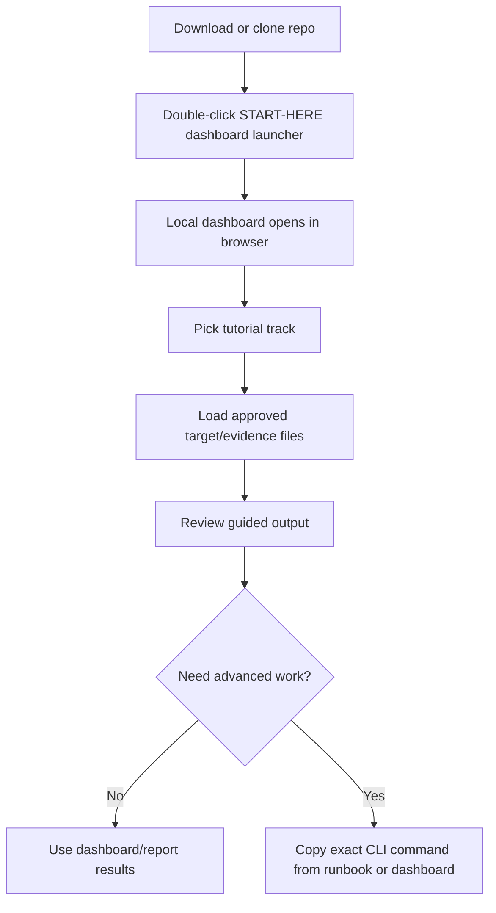

# Start Here — SysAdminSuite

You do **not** need to memorize command-line tools to use SysAdminSuite.

## I just downloaded or cloned the repo. What do I click?

Double-click this file at the repo root:

**`START-HERE-SysAdminSuite-Dashboard.bat`**

That is the normal front door for field users.

## What opens?

1. A small dashboard host starts on your computer (look for a tray icon near the clock).
2. Your browser opens the local dashboard at:

   `http://127.0.0.1:5000/dashboard/?tutorial=cybernet`

3. Click **Start Cybernet Survey** in the dashboard to follow the guided tutorial.

No internet is required after the repo is on your machine.

## What if it does not open?

Try these steps in order:

1. Make sure you double-clicked `START-HERE-SysAdminSuite-Dashboard.bat` from the **repo root**, not from inside a subfolder.
2. Wait a few seconds, then paste this into your browser:

   `http://127.0.0.1:5000/dashboard/?tutorial=cybernet`

3. If you see a message that the dashboard host could not start, a developer needs to build the host once on that machine:

   ```powershell
   powershell.exe -NoProfile -ExecutionPolicy Bypass -File tools\publish-dashboard-entrypoint.ps1
   ```

   That creates a local `SysAdminSuite Dashboard.exe` under `dist/SysAdminSuiteDashboard/` (gitignored). Then double-click `START-HERE-SysAdminSuite-Dashboard.bat` again.

4. Advanced fallback launchers (for IT staff):

   - `Launch-SysAdminSuiteDashboard.Host.bat`
   - `Launch-SysAdminSuite-Runtime.bat` (choose option 3)

5. Still stuck? Read [`docs/DASHBOARD_ENTRYPOINT.md`](docs/DASHBOARD_ENTRYPOINT.md).

## When do I use CLI commands?

Use command-line tools only when:

- the dashboard tells you to copy a specific command, or
- a runbook or lead explicitly asks for a Bash survey step.

CLI is for advanced survey work, not the default starting point.

For Cybernet / Neuron subnet survey CLI steps, see [`START-HERE-CYBERNET-NEURON-SURVEY.md`](START-HERE-CYBERNET-NEURON-SURVEY.md).

## Where is the Cybernet / Neuron survey tutorial?

- **Dashboard path (default):** double-click `START-HERE-SysAdminSuite-Dashboard.bat`, then use **Start Cybernet Survey**.
- **Full field runbook:** [`docs/tutorials/CYBERNET_NEURON_NETWORK_SURVEY.md`](docs/tutorials/CYBERNET_NEURON_NETWORK_SURVEY.md)
- **CLI urgent path:** [`START-HERE-CYBERNET-NEURON-SURVEY.md`](START-HERE-CYBERNET-NEURON-SURVEY.md)

## What files should I never commit?

Do not commit live operational evidence, including:

- target CSVs with real hostnames, serials, or MACs
- scan output under `logs/nmap/` or `survey/output/`
- packaged ZIPs under `survey/artifacts/`
- dashboards or reports containing site evidence

Keep those files on your admin workstation only.

## Workflow at a glance



## More help

- Dashboard details: [`docs/DASHBOARD_ENTRYPOINT.md`](docs/DASHBOARD_ENTRYPOINT.md)
- Dashboard UI notes: [`dashboard/README.md`](dashboard/README.md)
- Survey scripts (advanced): [`survey/README.md`](survey/README.md)
