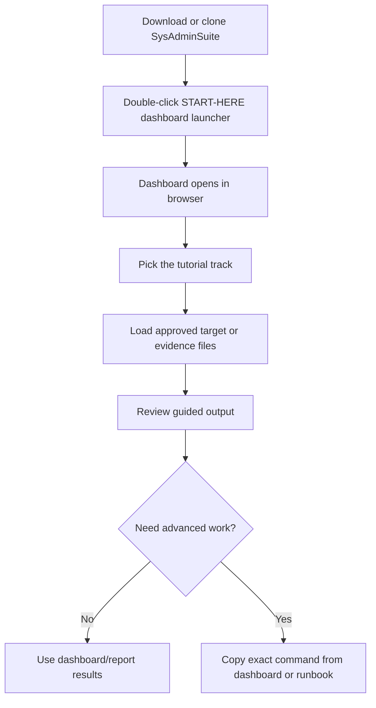

# Start Here — SysAdminSuite

You do **not** need to memorize command-line tools to use SysAdminSuite.

## "Am I supposed to get a set of code to run?"

No. For most users, do not start with command-line tools.

Double-click:

`START-HERE-SysAdminSuite-Dashboard.bat`

This opens the local dashboard and tutorial page.

Use CLI tools only when the dashboard or a runbook gives you a specific command.

## How do I download SysAdminSuite?

Choose the parent folder where you want SysAdminSuite to live (for example, your Desktop or a `dev` folder).

Run:

```bash
git clone https://github.com/EndeavorEverlasting/SysAdminSuite.git
```

This creates the `SysAdminSuite` folder.

Then open the `SysAdminSuite` folder and double-click:

`START-HERE-SysAdminSuite-Dashboard.bat`

**Do not** create a `SysAdminSuite` folder first and then clone inside it. That can create `SysAdminSuite\SysAdminSuite` and the launcher will not be at the top level where you expect it.

No Git? Use the green **Code** button on the GitHub page, choose **Download ZIP**, then extract it. The extracted folder contains `START-HERE-SysAdminSuite-Dashboard.bat`.

## I just downloaded or cloned the repo. What do I click?

Double-click **`START-HERE-SysAdminSuite-Dashboard.bat`** at the repo root.

That is the one file to start. (`START-HERE-SysAdminSuite-Dashboard.cmd` and `SysAdminSuite Dashboard.cmd` are compatibility aliases that do the same thing if your site prefers a `.cmd` shortcut — but the `.bat` is the documented front door.)

**Shortcut tip:** Right-click `START-HERE-SysAdminSuite-Dashboard.bat` → **Send to** → **Desktop (create shortcut)**.

## What opens?



1. A small dashboard host starts on your computer (look for a tray icon near the clock).
2. Your browser opens the local dashboard at:

   `http://127.0.0.1:5000/dashboard/?tutorial=cybernet`

3. The browser tab shows the Harold icon. Click **Start Cybernet Survey** to follow the guided tutorial.

On first run, the launcher may **automatically prepare (build) the dashboard app** for a minute before the browser opens. You do not need to run any command yourself. If this machine cannot build it (for example, no .NET SDK), the launcher will tell you to ask for the packaged SysAdminSuite Dashboard **field release** or have IT/admin prepare the workstation.

### Source clone vs field release package

| You have | Do this |
|----------|---------|
| Git + optional .NET SDK (developer/IT) | Clone the repo, double-click `START-HERE-SysAdminSuite-Dashboard.bat` |
| No .NET SDK (typical field PC) | Get the **field release ZIP** — see [`docs/DASHBOARD_FIELD_RELEASE.md`](docs/DASHBOARD_FIELD_RELEASE.md) — extract it, then double-click the `.bat` |

No internet is required after the repo or package is on your machine.

## What if the dashboard does not open?

1. Run `START-HERE-SysAdminSuite-Dashboard.bat` from the **repo root**, not from inside a subfolder.
2. The window will not close on its own — read any message it prints, then press a key to close it.
3. Paste into your browser: `http://127.0.0.1:5000/dashboard/?tutorial=cybernet`
4. The launcher tries to prepare the dashboard app automatically. If it reports that the app could not be built on this machine, ask for the packaged SysAdminSuite Dashboard release or have IT/admin prepare the workstation. You should not run the build command yourself.
5. Read [`docs/DASHBOARD_ENTRYPOINT.md`](docs/DASHBOARD_ENTRYPOINT.md) for IT troubleshooting.

## What about an EXE?

The repo does **not** ship a committed `.exe` today. Field users should use the `.bat` launcher above.

A future sprint will document shipping or building `SysAdminSuite Dashboard.exe` for shortcut-friendly desktops. See [`docs/DASHBOARD_EXE_FUTURE_SPRINT.md`](docs/DASHBOARD_EXE_FUTURE_SPRINT.md).

Developers / IT can build a local `.exe` now:

```powershell
powershell.exe -NoProfile -ExecutionPolicy Bypass -File tools\publish-dashboard-entrypoint.ps1
```

Output: `dist/SysAdminSuiteDashboard/SysAdminSuite Dashboard.exe` (gitignored, built on your machine only).

## When do I use CLI commands?

Only when the dashboard tells you to copy a command, or a runbook explicitly asks for Bash survey steps. CLI commands are optional and specific — they are not the default front door.

## Where is the Cybernet / Neuron survey tutorial?

- In the dashboard: click **Start Cybernet Survey** after the page opens.
- CLI runbook (advanced): [`START-HERE-CYBERNET-NEURON-SURVEY.md`](START-HERE-CYBERNET-NEURON-SURVEY.md)
- Full step-by-step: [`docs/tutorials/CYBERNET_NEURON_NETWORK_SURVEY.md`](docs/tutorials/CYBERNET_NEURON_NETWORK_SURVEY.md)

## What files should I never commit?

Live target CSVs, scan output, packaged ZIPs, serials, MACs, and site evidence. Keep them on your admin workstation only.

## More help

- Agent/IT canonical reference: [`docs/DASHBOARD_ENTRYPOINT.md`](docs/DASHBOARD_ENTRYPOINT.md)
- Dashboard UI: [`dashboard/README.md`](dashboard/README.md)
