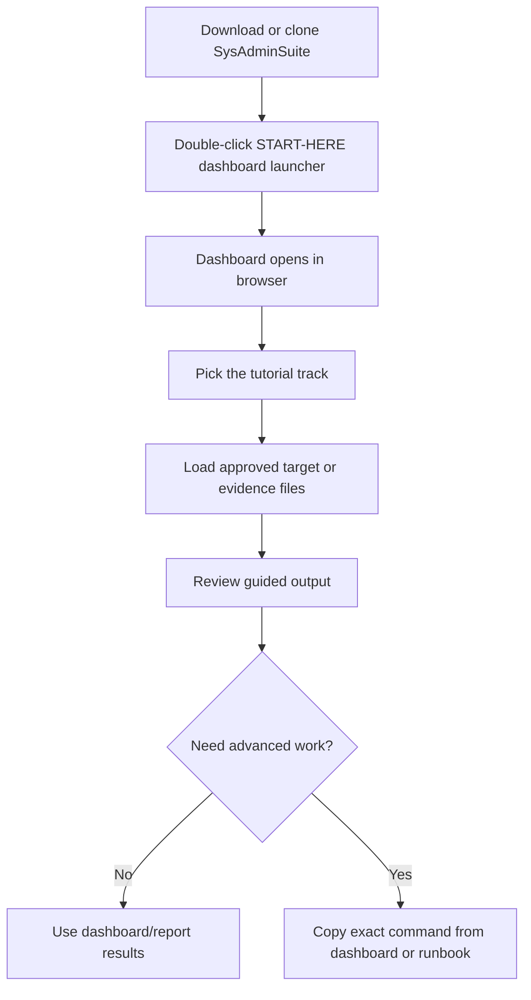

# Start Here — SysAdminSuite

You do **not** need to memorize command-line tools to use SysAdminSuite.

## "Am I supposed to get a set of code to run?"

No. For most users, do not start with command-line tools.

Double-click:

`START-HERE-SysAdminSuite-Dashboard.bat`

This opens the local dashboard and tutorial page.

Use CLI tools only when the dashboard or a runbook gives you a specific command.

## How do I download SysAdminSuite?

Choose the parent folder where you want SysAdminSuite to live (for example, your Desktop or a `dev` folder).

Run:

```bash
git clone https://github.com/EndeavorEverlasting/SysAdminSuite.git
```

This creates the `SysAdminSuite` folder.

Then open the `SysAdminSuite` folder and double-click:

`START-HERE-SysAdminSuite-Dashboard.bat`

**Do not** create a `SysAdminSuite` folder first and then clone inside it. That can create `SysAdminSuite\SysAdminSuite` and the launcher will not be at the top level where you expect it.

No Git? Use the green **Code** button on the GitHub page, choose **Download ZIP**, then extract it. The extracted folder contains `START-HERE-SysAdminSuite-Dashboard.bat`.

## I just downloaded or cloned the repo. What do I click?

Double-click **`START-HERE-SysAdminSuite-Dashboard.bat`** at the repo root.

That is the one file to start. (`START-HERE-SysAdminSuite-Dashboard.cmd` and `SysAdminSuite Dashboard.cmd` are compatibility aliases that do the same thing if your site prefers a `.cmd` shortcut — but the `.bat` is the documented front door.)

**Shortcut tip:** Right-click `START-HERE-SysAdminSuite-Dashboard.bat` → **Send to** → **Desktop (create shortcut)**.

## What opens?



1. A small dashboard host starts on your computer (look for a tray icon near the clock).
2. Your browser opens the local dashboard at:

   `http://127.0.0.1:5000/dashboard/?tutorial=setup`

3. The browser tab shows the Harold icon. Follow **Repo Setup**, then choose **Software Deployment**, **Cybernet Survey**, or another guided workflow.

On first run, the launcher may **automatically prepare the dashboard app** for a minute before the browser opens. If Microsoft .NET 8 dependencies are missing, it can download official Microsoft installers, verify them, and build the local dashboard host. You do not need to run any command yourself.

### Source clone vs field release package

| You have | Do this |
|----------|---------|
| Git + internet/admin approval for Microsoft installers | Clone the repo, double-click `START-HERE-SysAdminSuite-Dashboard.bat` |
| Locked-down PC where downloads or installs are blocked | Get the **field release ZIP** — see [`docs/DASHBOARD_FIELD_RELEASE.md`](docs/DASHBOARD_FIELD_RELEASE.md) — extract it, then double-click the `.bat` |

No internet is required after the dashboard dependencies are installed or the field release package is extracted. Bootstrap details: [`docs/DASHBOARD_DEPENDENCY_BOOTSTRAP.md`](docs/DASHBOARD_DEPENDENCY_BOOTSTRAP.md).

## How do updates work?

Updates are opt-in. If this is a git clone, the launcher can offer to fast-forward
clean `main` from `origin/main`. If this is a ZIP or field package, updates come
from a checksum-verified package manifest. In both cases, you approve before
anything changes. See [`docs/APPROVED_UPDATE_FLOW.md`](docs/APPROVED_UPDATE_FLOW.md).

## Repair / refresh my copy

If a tech needs to make the local copy match official `origin/main`, run the
field repair updater instead of typing raw Git commands:

```powershell
powershell.exe -NoProfile -ExecutionPolicy Bypass -File .\Update-SysAdminSuite.ps1
```

If your SysAdminSuite folder is not `%USERPROFILE%\Desktop\SysAdminSuite`, pass
the actual folder with `-InstallRoot`. The updater prints the target path and
requires `Type YES to update` before it repairs the repo.

Do not run `git clone` over an existing copy. The updater handles the three safe
cases: clone when the folder is missing, back up an existing non-git folder, or
repair an existing Git repo.

Important: the repair updater runs `git reset --hard origin/main` and
`git clean -fd` inside the SysAdminSuite repo. That makes the local copy match
official `main`, and local edits inside the repo are discarded. See
[`docs/FIELD_TECH_UPDATE.md`](docs/FIELD_TECH_UPDATE.md).

## What if the dashboard does not open?

1. Run `START-HERE-SysAdminSuite-Dashboard.bat` from the **repo root**, not from inside a subfolder.
2. The window will not close on its own — read any message it prints, then press a key to close it.
3. Paste into your browser: `http://127.0.0.1:5000/dashboard/?tutorial=setup`
4. The launcher tries to prepare the dashboard app automatically. If it reports that dependency download, Microsoft .NET installation, or build preparation failed, ask for the packaged SysAdminSuite Dashboard release or have IT/admin prepare the workstation. You should not run the build command yourself.
5. Read [`docs/DASHBOARD_ENTRYPOINT.md`](docs/DASHBOARD_ENTRYPOINT.md) for IT troubleshooting.

## What about an EXE?

The repo does **not** ship a committed `.exe` today. Field users should use the `.bat` launcher above.

A future sprint will document shipping or building `SysAdminSuite Dashboard.exe` for shortcut-friendly desktops. See [`docs/DASHBOARD_EXE_FUTURE_SPRINT.md`](docs/DASHBOARD_EXE_FUTURE_SPRINT.md).

Developers / IT can build a local `.exe` now:

```powershell
powershell.exe -NoProfile -ExecutionPolicy Bypass -File tools\publish-dashboard-entrypoint.ps1
```

Output: `dist/SysAdminSuiteDashboard/SysAdminSuite Dashboard.exe` (gitignored, built on your machine only).

## When do I use CLI commands?

Only when the dashboard tells you to copy a command, or a runbook explicitly asks for Bash survey steps. CLI commands are optional and specific — they are not the default front door.

## Where is the Cybernet / Neuron survey tutorial?

- In the dashboard: click **Start Cybernet Survey** after the page opens.
- CLI runbook (advanced): [`START-HERE-CYBERNET-NEURON-SURVEY.md`](START-HERE-CYBERNET-NEURON-SURVEY.md)
- Full step-by-step: [`docs/tutorials/CYBERNET_NEURON_NETWORK_SURVEY.md`](docs/tutorials/CYBERNET_NEURON_NETWORK_SURVEY.md)

## Where is the software deployment tutorial?

The **web interface is the canonical technician tutorial**.

- Open the dashboard and click **Start Software Deployment**.
- Direct route: `http://127.0.0.1:5000/dashboard/?tutorial=software-deployment`
- The web wizard guides the generated dummy-installer proof, exact evidence review, one-target WhatIf plan, confirmation-enabled pilot, and stop/expand decision.
- Supporting written runbook: [`docs/tutorials/SOFTWARE_DEPLOYMENT_DRY_RUN_AND_PILOT.md`](docs/tutorials/SOFTWARE_DEPLOYMENT_DRY_RUN_AND_PILOT.md)
- Implementation and evidence reference: [`docs/SOFTWARE_INSTALL_E2E.md`](docs/SOFTWARE_INSTALL_E2E.md)

## Where is the developer workstation tutorial?

- Full step-by-step: [`docs/tutorials/DEVELOPER_WORKSTATION.md`](docs/tutorials/DEVELOPER_WORKSTATION.md)
- The daily path is **WezTerm → tmux `dev` → coding agents**.
- Windows requires Ubuntu WSL2 as the tmux backend; a graphical native-Linux host runs WezTerm and tmux locally.
- PowerShell 7 is the Windows fallback/admin shell. macOS is unsupported, and WSL evidence is never native-Linux proof.
- Start with read-only Inventory and Plan. Apply, Stop, and Rollback require explicit review and authorization.
- Release and proof status: [`docs/DEVELOPER_WORKSTATION_CONVERGENCE_REPORT.md`](docs/DEVELOPER_WORKSTATION_CONVERGENCE_REPORT.md)

## What files should I never commit?

Live target CSVs, scan output, packaged ZIPs, generated installer executables, software-install evidence, serials, MACs, and site evidence. Keep them on your admin workstation only.

### Where to put local Cybernet sources

Keep live operational files out of git. Use ignored local paths only:

| Path | Use |
|------|-----|
| `targets/local/` | Approved manifest CSVs, AD exports, and other intake files you load into the dashboard |
| `logs/targets/` | Local target-store copies the dashboard or survey scripts reference during a run |

Policy and naming rules: [`docs/TARGETS_FOLDER_POLICY.md`](docs/TARGETS_FOLDER_POLICY.md). Survey lane map: [`docs/SURVEY_LANES.md`](docs/SURVEY_LANES.md).

## More help

- Agent/IT canonical reference: [`docs/DASHBOARD_ENTRYPOINT.md`](docs/DASHBOARD_ENTRYPOINT.md)
- Dashboard UI: [`dashboard/README.md`](dashboard/README.md)
