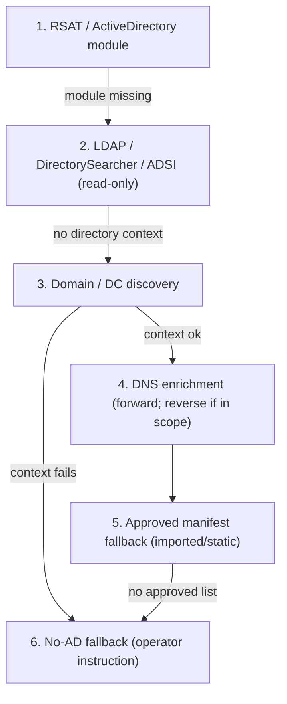

# Active Directory Probe Resilience and Ambiguity Doctrine

Active Directory probes in SysAdminSuite are **resilient, read-only discovery paths** with explicit
fallback mechanisms, local operator-side evidence, and clear state classification.

AD is a **registration and directory source**. It is not proof that a device is currently live,
reachable, correctly subnetted, physically present, or matched to a serial number. No single AD
method is authoritative by itself.

This doctrine gives the AD side the same operator-clarity guarantee as the dashboard Back/Stop
controls: the operator must never be trapped in confusion. AD results must say whether a machine is
**registered, reachable, stale, blocked, ambiguous, imported, or simply not proven**.

## When this applies

Any sprint that touches:

- AD discovery or live AD queries
- subnet discovery or Cybernet targeting
- registered-device inventory
- hostname matching or bounded hostname-variant expansion
- AD-derived manifests

must implement or verify the fallback ladder and the state classifications below.

## Required fallback ladder



1. **Preferred AD query path** — RSAT / ActiveDirectory module when available
   (`Get-ADComputer`-style computer-object lookup).
2. **Secondary AD query path** — LDAP / DirectorySearcher / ADSI lookup when RSAT is missing. Must
   remain read-only.
3. **Domain/controller discovery path** — detect domain context and a reachable domain controller
   before blaming the query. If domain discovery fails, classify as **environment-blocked**, not
   "no devices found".
4. **DNS enrichment path** — forward DNS lookup for AD hostnames when authorized; reverse lookup
   only when needed and in scope. A DNS mismatch is classified **separately** from AD absence.
5. **Approved manifest fallback** — if live AD access is blocked, accept an approved exported AD
   list, CSV, or operator-provided target manifest. Mark it **imported/static evidence**, not live
   AD proof.
6. **No-AD fallback** — if AD access is unavailable, generate a clear operator instruction
   describing exactly what evidence is missing and what file/output would unblock the workflow.

## Required AD state classifications

AD probe outputs classify ambiguity instead of collapsing it into pass/fail:

| State | Meaning |
|---|---|
| `AD_CONFIRMED` | AD object found and corroborated (e.g. DNS + reachability/identity agree) |
| `AD_OBJECT_FOUND_DNS_FOUND` | AD object found, forward DNS resolves |
| `AD_OBJECT_FOUND_DNS_MISSING` | AD object found, no DNS record |
| `AD_OBJECT_FOUND_DNS_MISMATCH` | AD object found, DNS resolves to a conflicting name/address |
| `AD_OBJECT_FOUND_STALE` | AD object found but last-logon/password age exceeds staleness threshold |
| `AD_OBJECT_FOUND_DISABLED` | AD object found but the computer account is disabled |
| `AD_OBJECT_FOUND_WRONG_OU` | AD object found in an unexpected / forbidden OU |
| `AD_DUPLICATE_CANDIDATES` | Multiple candidate objects match; no single authoritative record |
| `AD_NOT_FOUND` | Query ran successfully, no matching object |
| `AD_QUERY_BLOCKED` | Query path failed (module/tooling error), distinct from "not found" |
| `DOMAIN_CONTEXT_UNKNOWN` | Domain context could not be determined |
| `DOMAIN_CONTROLLER_UNREACHABLE` | Domain known, no DC reachable |
| `PERMISSION_BLOCKED` | Access denied / insufficient rights |
| `IMPORTED_STATIC_EVIDENCE` | Result came from an approved exported list, not live AD |
| `NOT_AD_VERIFIED` | Reachability/identity exists but AD registration is unproven |
| `NEEDS_OPERATOR_REVIEW` | Ambiguous/duplicate/conflicting; requires human reconciliation |

## Grey-area handling

- A hostname found in AD is **not** proof of reachability.
- A reachable IP is **not** proof of AD registration.
- A DNS match is **not** proof of serial identity.
- A serial match usually requires a **separate** inventory source: endpoint WMI/CIM, SCCM, MDM,
  vendor inventory, or operator evidence.
- A stale AD object must **not** be treated as an active deployment target without review.
- Multiple matching names, prefixes, aliases, or duplicate candidates surface as
  `NEEDS_OPERATOR_REVIEW`.
- Missing AD results must distinguish `AD_NOT_FOUND` from `AD_QUERY_BLOCKED`,
  `DOMAIN_CONTROLLER_UNREACHABLE` / `DOMAIN_CONTEXT_UNKNOWN`, and `PERMISSION_BLOCKED`.

## Private / local logging behavior

Private logging means **local, operator-side, repo-ignored** diagnostic evidence for clarity and
reproducibility. It must **not** mean hiding activity, suppressing telemetry, clearing logs,
bypassing endpoint tools, or evading organizational monitoring.

- Write local diagnostic logs only to approved ignored paths (`logs/`, `tmp/`, `survey/output/`,
  `evidence/`, or another repo-ignored evidence folder).
- Never commit live AD exports, domain inventory, host lists, serial lists, credentials, tokens, or
  operational evidence.
- Include timestamps, query mode used, fallback path used, domain/DC discovery status, record
  counts, and classification counts.
- Redact or minimize sensitive values in summaries where possible.
- Preserve enough local detail for the operator to understand why a device is classified as found,
  missing, stale, blocked, ambiguous, or imported.
- Final reports summarize counts and classifications, not live directory contents.

## Required confusion-reduction output

Every AD probe run emits this summary (counts only; no live directory dump):

```text
AD PROBE STATE SUMMARY:
- Query mode used:
- Fallback mode used:
- Domain context:
- Domain controller status:
- Permission status:
- Input target count:
- AD objects found:
- DNS enriched:
- Stale objects:
- Disabled objects:
- Duplicate candidates:
- Not found:
- Blocked / unknown:
- Needs operator review:
- Local ignored log path:
- Evidence committed: none, or sanitized fixture only
```

## Validation contracts

When validating AD probe logic, contracts must prove:

- read-only behavior
- fallback path selection
- clear blocked-state classification
- no committed live evidence
- no credential capture
- no scan broadening beyond approved manifests
- useful local ignored logs are produced or documented
- ambiguous states are classified instead of silently dropped

If the agent cannot access a real domain runtime, it must **not** pretend AD validation ran. Use
fixtures/mocks for contract validation, classify live AD validation as **blocked by runtime
access**, and produce the exact operator command or evidence file needed for a future authorized
validation.

### Offline contract coverage (this repo)

- Field-facing wrapper: [`survey/sas-export-ad-registered-population.sh`](../survey/sas-export-ad-registered-population.sh)
  — delegates to the offline reconcile contract and emits dashboard-ready roster outputs from approved AD CSV exports.
- Fixture: [`survey/fixtures/ad_probe_states.sample.csv`](../survey/fixtures/ad_probe_states.sample.csv)
  — synthetic `CYBTEST*` / `WNH000TEST*` rows enumerating every required state.
- Test: [`tests/survey/test_ad_probe_resilience_contracts.py`](../tests/survey/test_ad_probe_resilience_contracts.py)
  — asserts taxonomy coverage, the documented fallback ladder, the `AD PROBE STATE SUMMARY`
  template, and the absence of obvious live/private values.
- Runner: [`tests/survey/run_offline_survey_tests.sh`](../tests/survey/run_offline_survey_tests.sh).

### Live validation boundary

Live AD validation requires an authorized domain runtime and is **out of scope for offline CI**.
The exact future operator command for authorized validation:

```bash
pwsh survey/sas-ad-identity-export.ps1 \
  -Manifest logs/targets/approved_manifest.csv \
  -Output survey/output/ad_identity_evidence.csv
```

That command, run on a domain-joined or RSAT-equipped operator workstation against an approved
manifest, produces the live evidence CSV. Until then, live AD validation is classified
`blocked by runtime access`.

## Code migration checklist (future authorized sprint)

The live helper [`survey/sas-ad-identity-export.ps1`](../survey/sas-ad-identity-export.ps1) is the
integration point. It currently emits a smaller status set (`ad_object_found`, `ad_no_match`,
`ad_multiple_matches`, `ad_query_failed`, `ad_probe_limited`, `ad_probe_unavailable`). A future
authorized sprint should:

1. Add explicit domain/DC discovery before query, emitting `DOMAIN_CONTEXT_UNKNOWN` /
   `DOMAIN_CONTROLLER_UNREACHABLE` instead of generic failure.
2. Replace broad wildcard LDAP (`name=*$id*`) with bounded candidate lookups per
   [`CYBERNET_HOSTNAME_VARIANT_DOCTRINE.md`](CYBERNET_HOSTNAME_VARIANT_DOCTRINE.md).
3. Map internal statuses to the classification table above (DNS missing/mismatch, stale, disabled,
   wrong OU, permission blocked, duplicate candidates).
4. Add a DNS enrichment pass that classifies `AD_OBJECT_FOUND_DNS_MISSING` /
   `AD_OBJECT_FOUND_DNS_MISMATCH` separately from AD absence.
5. Accept an approved exported list and tag rows `IMPORTED_STATIC_EVIDENCE`.
6. Emit the `AD PROBE STATE SUMMARY` and write diagnostics only to ignored paths.

## Related documents

- [AD_REGISTERED_POPULATION.md](AD_REGISTERED_POPULATION.md) — AD as population authority
- [AD_CYBERNET_EXPORT_CONTRACT.md](AD_CYBERNET_EXPORT_CONTRACT.md) — offline export CSV contract
- [CYBERNET_HOSTNAME_VARIANT_DOCTRINE.md](CYBERNET_HOSTNAME_VARIANT_DOCTRINE.md) — bounded variant discovery
- [CYBERNET_EVIDENCE_CORRELATION.md](CYBERNET_EVIDENCE_CORRELATION.md) — multi-source evidence merge
