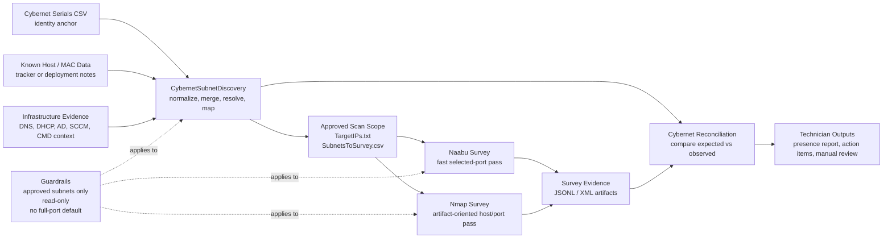

# Cybernet Discovery Workflow

This is the technician-facing structure view for Cybernet subnet discovery and survey handoff.

Use this diagram to explain how serial inventory, infrastructure evidence, Naabu, Nmap, and reconciliation fit together.

## Operator rule

Do not start with a guessed subnet scan.

Start with serials, attach infrastructure evidence, generate approved scope, then survey with Naabu or Nmap.
