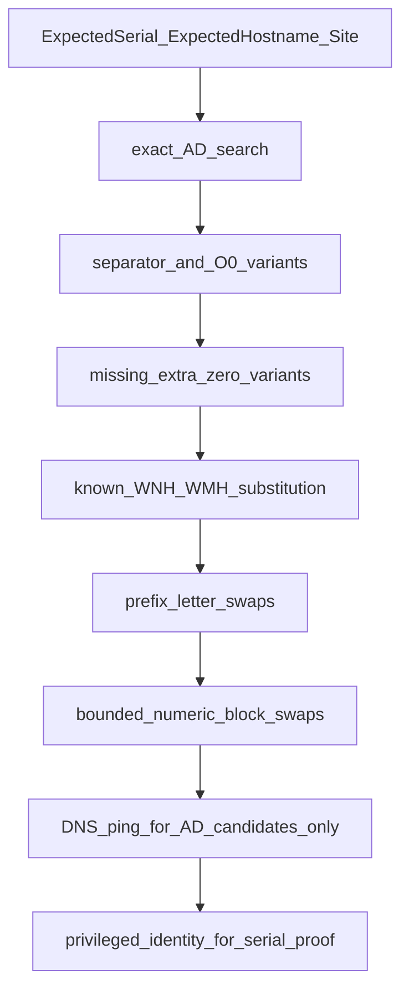

# Cybernet Hostname Variant Doctrine

## Purpose

This doctrine defines how SysAdminSuite expands a single expected Cybernet hostname into a
**bounded** set of candidate hostnames for Active Directory (AD) discovery, when the recorded
hostname may contain a human recollection or typing error.

This is **naming-doctrine fuzzing**, not character-level fuzzy search. It is driven by the
specific mistakes Northwell field staff actually make, not by generic edit-distance expansion.

## Core Principle

Hostname variant expansion is a **candidate discovery** aid. It is never identity proof.

- Candidates are generated only from approved target manifests using `ExpectedSerial`,
  `ExpectedHostname`, and `Site`.
- No wildcard or unbounded fuzzy AD search.
- No queries outside the bounded candidate set.
- An AD variant match can become a high-confidence **candidate**. It can never become
  **serial-confirmed**. Serial proof requires a privileged identity check.

## Why This Is Not Generic Typo Fuzzing

The system must distinguish between fundamentally different error types:

| Error type | Example | Meaning |
|---|---|---|
| Bad keystroke typo | `WNH269OPR009` -> `WNH269OOR009` | Random slip; low signal |
| Wrong site prefix recollection | `WNH...` written for an NSUH site | Memory error about facility naming |
| Number transposition | `269` -> `296` | Digit-order slip; explodes fast if unbounded |
| Known facility-prefix substitution | `WNH` <-> `WMH` | Predictable confusion between real facility prefixes |

These are not equal. Treating them all as one fuzzy bucket is how you "find" ghosts and call it
progress. Each class below carries its own confidence tier and required next action.

## Site-Affinity Rules (WNH / WMH)

`WNH` and `WMH` prefix swaps are treated as **controlled site-affinity variants**, not generic
typo variants, because staff predictably confuse these facility prefixes.

Loose recollection (association, not a hard mapping):

| Prefix | Loose lineage association |
|---|---|
| `WNH` | LIJ / LIJ lineage |
| `WMH` | NSUH / Manhasset / NSUH lineage |

The agent must not blindly promote a prefix-substituted match. When the manifest `Site` conflicts
with the substituted prefix, classify and stop for review:

- `ad_prefix_site_mismatch`
- `serial_unverified`
- `needs_site_context_review`

Example: a record written `WMH269OPR009` whose site is LIJ may be a prefix-memory error. Same in
reverse for `WNH269OPR009` at an NSUH site. Neither auto-promotes to a confirmed match.

## Variant Classes

Variant generation runs in this fixed order. Each class is bounded.

### 1. Separator-only variants

Separator presence/placement only. Highest-fidelity, non-semantic.

```text
WNH269OPR009
WNH-269-OPR-009
WNH269-OPR009
```

### 2. O/0 swaps in OPR-like segments

The letter `O` and digit `0` confusion inside the OPR-style segment.

```text
WNH269OPR009
WNH2690PR009
WNH269OPRO09
WNH2690PRO09
```

### 3. Missing or extra zero

Zero-count drift in the numeric suffix.

```text
WNH269OPR009
WNH269OPR09
WNH269OPR0009
```

### 4. Known prefix substitution (WNH <-> WMH)

Controlled site-affinity substitution. Stronger than a random typo because the confusion is
known, but it **must** be checked against site context (see Site-Affinity Rules above).

```text
WNH269OPR009
WMH269OPR009
```

### 5. Prefix letter transposition

Reordering of the three prefix letters. Useful for AD candidate discovery only; low confidence.

```text
WNH269OPR009
NWH269OPR009
WHN269OPR009
HNW269OPR009
```

### 6. Numeric block transposition

Digit-order swaps within a numeric block. **Hard bounded**: only adjacent single-swap
permutations of one numeric block, never a full permutation explosion. Discovery candidates only.

```text
WNH269OPR009
WNH296OPR009
WNH629OPR009
WNH269OPR090
WNH269OPR900
```

### 7. Wildcard prefix match

Review-only. Never auto-promoted to a match.

## Confidence Ranking

Every candidate carries exactly one confidence tier.

| Variant type | Confidence |
|---|---:|
| exact hostname | highest |
| separator-only variant | high |
| O/0 swap in known OPR segment | medium-high |
| missing/extra zero | medium |
| known WNH/WMH substitution with matching site | medium |
| known WNH/WMH substitution with wrong site | low / review |
| prefix letter transposition | low |
| numeric block transposition | low |
| wildcard prefix match | review only |

The cap is absolute:

```text
A typo-expanded AD match can become a high-confidence candidate.
It cannot become serial-confirmed.
```

## Status Taxonomy

These statuses extend, and do not replace, the existing AD evidence statuses emitted by
[`survey/sas-ad-identity-export.ps1`](../survey/sas-ad-identity-export.ps1) (`ad_object_found`,
`ad_no_match`, `ad_multiple_matches`, etc.) until a separate migration sprint is authorized.

| Status | Meaning | Next action |
|---|---|---|
| `ad_exact_match` | Exact hostname found in AD | Proceed to reachability / identity |
| `ad_variant_match` | A bounded variant matched in AD | Candidate only; confirm before trust |
| `ad_prefix_variant_match` | Prefix-class variant matched | Candidate; verify site context |
| `ad_known_prefix_substitution` | WNH<->WMH substitution matched | Verify against `Site` |
| `ad_prefix_site_mismatch` | Substituted prefix conflicts with site | Hold for human site review |
| `ad_number_transposition_candidate` | Numeric-block swap candidate | Discovery only; do not trust |
| `ad_letter_transposition_candidate` | Prefix-letter swap candidate | Discovery only; do not trust |
| `serial_unverified` | No privileged serial confirmation yet | Run privileged identity check |
| `needs_site_context_review` | Human must reconcile site vs prefix | Route to operator review |
| `needs_privileged_identity` | Serial proof requires privileged probe | Schedule approved identity check |
| `not_found_in_ad` | No exact or bounded variant matched | Manifest/data review |

## Candidate Pipeline



Order matters: stronger, non-semantic variants are tried before site-semantic and transposition
classes. DNS and ping run only for generated AD candidates. Serial proof is always last and always
requires a privileged identity check.

## Anti-Soup Guardrails

- Do not allow variant expansion to become broad fuzzy AD search (`Name -like '*'` against
  unbounded patterns is forbidden).
- Generate candidates only from approved target manifests. Do not scan or query outside the
  bounded candidate set.
- Do not treat AD variant matches as serial proof.
- Any multiple-match result remains review-required and never auto-resolves.
- Keep all live outputs in gitignored paths (`survey/output/`, `logs/targets/`).
- This is transparent, low-noise survey discipline and scope control. It is not stealth, evasion,
  log suppression, or detection avoidance. Authorized traffic may be monitored; that is expected.

## Subnet location inference (WNH / WMH mixing)

Subnet/location inference ([`CYBERNET_SUBNET_LOCATION_INFERENCE.md`](CYBERNET_SUBNET_LOCATION_INFERENCE.md)) may show **WNH** and **WMH** hostnames sharing the same mechanical subnet. That is **review-required enrichment**, not variant auto-resolution.

- Do not treat a mixed subnet map as proof that prefix substitution was correct.
- Do not promote mixed subnet evidence to serial-confirmed or to approved scan scope.
- Hold for `needs_site_context_review` / `subnet_location_mixed` and reconcile site context separately from AD variant candidate discovery.

Hostname variant expansion and subnet location inference are complementary read-only lanes. Neither replaces privileged serial proof.

## Relationship to Existing Doctrine

- AD remains the registered population authority per
  [`AD_REGISTERED_POPULATION.md`](AD_REGISTERED_POPULATION.md). Variant matches are candidate
  discovery, not population membership.
- AD probe resilience, the fallback ladder, and the ambiguity state classifications that bounded
  variant discovery feeds into are governed by
  [`AD_PROBE_RESILIENCE.md`](AD_PROBE_RESILIENCE.md). A variant match is never serial-confirmed and
  must be classified (e.g. `NEEDS_OPERATOR_REVIEW`) rather than collapsed to pass/fail.
- Reachability validation stays governed by
  [`LOW_NOISE_SURVEY_DOCTRINE.md`](LOW_NOISE_SURVEY_DOCTRINE.md) and the Naabu/Nmap profiles.
- Manifest ingestion and identity transport context live in
  [`CYBERNET_XLSX_TARGET_INGESTION.md`](CYBERNET_XLSX_TARGET_INGESTION.md) and
  [`CYBERNET_EVIDENCE_CORRELATION.md`](CYBERNET_EVIDENCE_CORRELATION.md).
- Subnet/location enrichment from hostname/IP evidence is documented in
  [`CYBERNET_SUBNET_LOCATION_INFERENCE.md`](CYBERNET_SUBNET_LOCATION_INFERENCE.md).

## Repo-agent addendum

```text
Add hostname variant doctrine for Cybernet AD enrichment.

People commonly confuse Cybernet hostname prefixes and number blocks.

Known prefix confusion:
- WNH and WMH may be swapped by humans.
- Loose recollection: WNH maps more often to LIJ lineage; WMH maps more often to NSUH/Manhasset lineage.
- Treat WNH<->WMH as a controlled known-prefix substitution, not as a generic typo.
- If site context conflicts with the prefix, classify as ad_prefix_site_mismatch and needs_site_context_review.

Additional variant classes:
- prefix letter transposition, such as WNH -> NWH / WHN / HNW
- known prefix substitution, especially WNH <-> WMH
- numeric block transposition after prefix, such as 269 -> 296 / 629
- O/0 swaps in OPR-like segments
- missing or extra zero variants
- separator variants

Do not allow variant expansion to become broad fuzzy AD search.
Use bounded candidate generation from approved target manifests only.
Do not scan or query outside approved hostname candidates.
Do not treat AD variant matches as serial proof.

Add or document statuses:
- ad_exact_match
- ad_variant_match
- ad_prefix_variant_match
- ad_known_prefix_substitution
- ad_prefix_site_mismatch
- ad_number_transposition_candidate
- ad_letter_transposition_candidate
- serial_unverified
- needs_site_context_review
- needs_privileged_identity
- not_found_in_ad

Ranking doctrine:
- exact match beats all
- separator-only and O/0 variants are stronger than prefix substitutions
- WNH<->WMH substitution is useful but must be checked against site
- numeric transpositions are discovery candidates only
- any multiple match result must remain review-required
```

## Status

This is doctrine and policy. No variant generator code, contract tests, or AD status migrations
exist yet. Implementation is a separate, explicitly authorized sprint. Until then, agents treat
this document as the binding specification for any hostname variant work.
