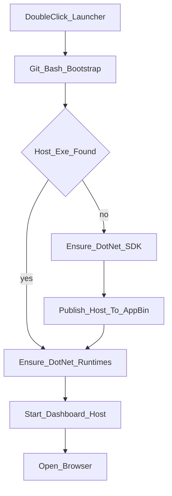

# Dashboard Dependency Bootstrap

SysAdminSuite dashboard launchers prepare the local dashboard host before the
browser opens. The bootstrap is Bash-first and uses official Microsoft .NET
installers only.

## What Gets Ensured

The dashboard host is a framework-dependent Windows app. It needs:

- `.NET 8 ASP.NET Core Runtime` (`Microsoft.AspNetCore.App`)
- `.NET 8 Windows Desktop Runtime` (`Microsoft.WindowsDesktop.App`)
- `.NET 8 SDK` only when a source checkout has no built host yet

Pinned installer metadata lives in [`Config/dotnet-bootstrap.json`](../Config/dotnet-bootstrap.json).
Downloaded installers are cached under `tools/cache/dotnet/`, which is ignored
by git.

Live toolbox probe output is written to `dashboard/toolbox-status.json` (also
gitignored). See [`DASHBOARD_TOOLBOX_TUTORIAL.md`](DASHBOARD_TOOLBOX_TUTORIAL.md).

## First-Run Flow



## Launcher Contract

`START-HERE-SysAdminSuite-Dashboard.bat` is the field front door. It calls
`Launch-SysAdminSuiteDashboard.Host.bat`, which calls:

```bash
bash scripts/ensure-dashboard-host.sh
```

That script:

1. Reuses an existing host if one is present.
2. Ensures the required .NET 8 runtimes system-wide.
3. Installs the official Microsoft .NET 8 SDK only when a source checkout must
   build the host.
4. Publishes the host to `app/bin/`, an ignored packaged-layout path reused by
   later launches.

The browser URL cannot install dependencies on its own. If a user types
`http://127.0.0.1:5000/dashboard/` and nothing is listening, they must run the
launcher first.

## Browser, CMD, And EXE Entry Points

- `.bat` and `.cmd` launchers run the Bash bootstrap before opening the browser.
- Browser-only entry works after the local host is already running; it cannot
  install OS dependencies by itself.
- Framework-dependent `.NET` EXEs cannot bootstrap a missing .NET runtime before
  process startup. EXE-first delivery needs either a self-contained publish or a
  small native bootstrapper; until then, use `START-HERE-SysAdminSuite-Dashboard.bat`
  or its `.cmd` aliases as the dependency-preparing front door.

## Safety And Hygiene

- No `winget`, Chocolatey, or third-party package sources are used.
- Installer hashes come from Microsoft .NET release metadata and are verified
  with SHA512 before execution.
- `--dry-run` is available for contract tests and operator review.
- Installer cache and publish outputs stay local and ignored.
- System-wide installation may create normal OS, installer, and endpoint
  telemetry. The suite uses scope control and clear operator intent; it does
  not attempt to hide or suppress logs.

## Failure Guidance

| Failure | Likely Cause | Next Action |
|---------|--------------|-------------|
| Git Bash missing | Git for Windows is not installed or not on PATH | Install Git for Windows or use the field release package |
| Download/checksum failure | Microsoft download blocked or tampered/incomplete file | Retry on approved network or have IT stage the field release |
| Install failure | Administrator approval required or installer blocked | Have IT/admin prepare the workstation |
| Build failure | SDK install blocked or source checkout incomplete | Use the field release package or inspect build output |

Field release packages remain valid for locked-down PCs. They avoid the SDK
build path and ship a pre-built host under `app/bin/`.
