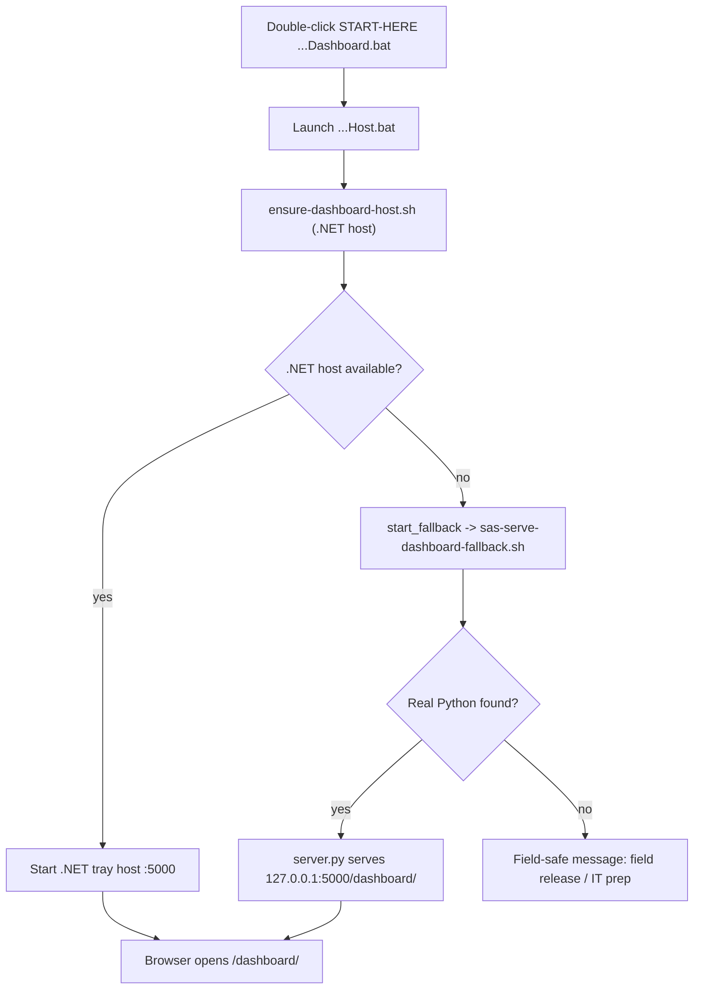

# Dashboard Server Fallback

Agent + operator reference for how the dashboard guarantees a running local server.

## Problem this solves

The documented field front door is a double-click of
`START-HERE-SysAdminSuite-Dashboard.bat`, which serves the dashboard at
`http://127.0.0.1:5000/dashboard/`. The primary server is the .NET tray host
(`src/SysAdminSuite.DashboardHost`), prepared on first run by
`scripts/ensure-dashboard-host.sh` (`dotnet publish` into `app/bin`).

On workstations without the .NET 8 SDK, with blocked Microsoft downloads, or
with a failed build, that host is never produced. Previously the launcher then
dead-ended with an "ask IT / use the field release" message, which pushed
technicians toward raw `cmd`/PowerShell instead of the dashboard. The server
"didn't actually launch."

## The bridge

The launcher now keeps a **local-only Python fallback** so a double-click still
serves the dashboard:

1. `Launch-SysAdminSuiteDashboard.Host.bat` tries the .NET host first (unchanged
   priority). Its `:find_host` now also checks the `win-x64` runtime-identifier
   build folders, so an already-built host is not missed.
2. If the host cannot be prepared (`ensure-dashboard-host.sh` non-zero) or no
   host executable is located, the launcher calls `:start_fallback`.
3. `:start_fallback` launches `scripts/sas-serve-dashboard-fallback.sh`, which
   finds a real Python (verified with `--version`, skipping the non-functional
   Windows Store stubs) and runs the repo's own `server.py`.
4. `server.py` serves the identical `/dashboard/` surface and now honors
   `SAS_DASHBOARD_BIND` / `SAS_DASHBOARD_PORT`; the fallback binds `127.0.0.1:5000`.
5. `START-HERE-SysAdminSuite-Dashboard.bat` then performs its existing health
   check and opens the browser. No change to the user's steps.

## Doctrine notes

- This is an **internal launcher fallback**, not user-facing guidance. The
  double-click `.bat` stays the front door and the .NET host stays primary.
- It uses the suite's own `server.py`, never a raw `python -m http.server`, and
  binds `127.0.0.1` only (local-only, not `0.0.0.0`).
- The fallback is a static file server only; it does not run survey, credential,
  or remote-command tooling.

## Files

- `scripts/sas-serve-dashboard-fallback.sh` - Bash-first fallback launcher.
- `server.py` - shared static server, env-overridable bind/port.
- `Launch-SysAdminSuiteDashboard.Host.bat` - `:start_fallback` + win-x64 paths.
- `scripts/ensure-dashboard-host.sh` - win-x64 paths in `find_host`.
- `Tests/bash/test_dashboard_entrypoint_contracts.sh` - fallback contracts.
