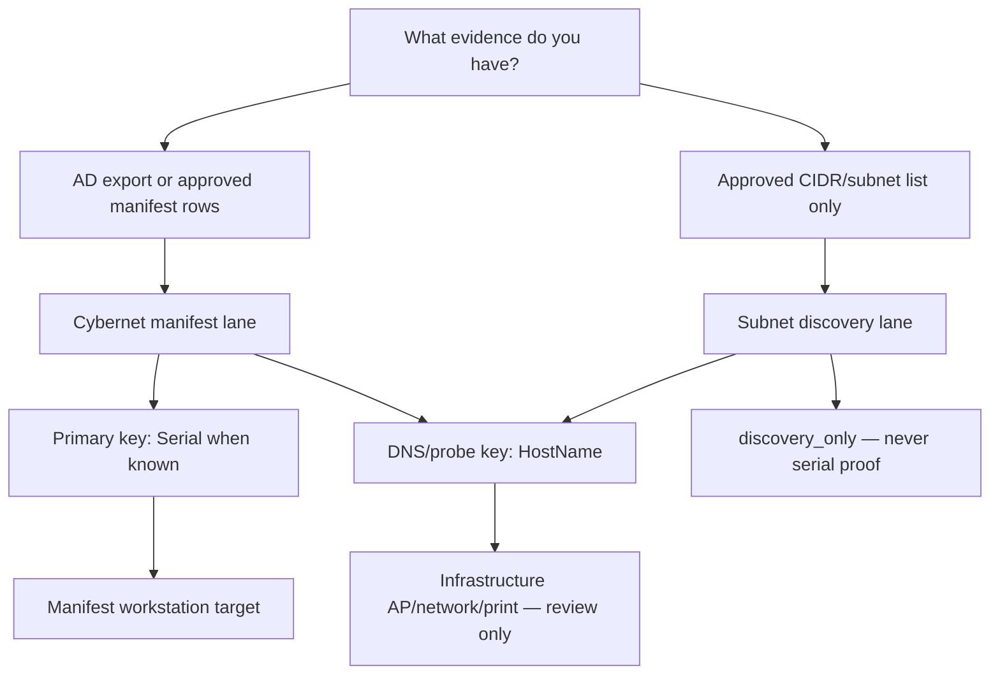

# Survey Lanes — Technician Map

This document is the canonical map for **which survey job you are running** and **which identifier key to use at each step**. It complements serial-first and subnet-inference doctrine without changing low-noise survey discipline.

## Two orthogonal axes

| Axis | Question | Values |
|------|----------|--------|
| **Survey lane** | What job am I doing? | Cybernet manifest lane · Subnet discovery lane |
| **Identifier lane** | What key am I using right now? | Serial · HostName · MAC |

DNS and probes may also report a **device role** (workstation vs access point vs network gear vs printer). Infrastructure findings are expected in subnet discovery; they are informational, not product failures.

## When to use each survey lane

### Cybernet manifest lane

Use when you have **AD export or approved manifest rows** and your goal is **serial-confirmed workstation survey**.

| Item | Detail |
|------|--------|
| Population authority | AD export / approved manifest |
| Typical entry | Dashboard **Start Cybernet Survey** or `survey/sas-survey-targets.sh` |
| Identity proof | **Serial-first** — hostname is a probe transport hint; MAC supports correlation only |
| Output paths | `survey/output/cybernet_dns_resolution_report.csv`, merged evidence CSVs |

See also: [`CYBERNET_SERIAL_FIRST_SURVEY.md`](CYBERNET_SERIAL_FIRST_SURVEY.md)

### Subnet discovery lane

Use when you have **approved CIDR/subnet lists** and your goal is **find what is on the wire / infer location context**. Access points and other infrastructure are expected.

| Item | Detail |
|------|--------|
| Population authority | Approved CIDR/subnet list only — not AD population |
| Typical entry | `survey/sas-cybernet-subnet-survey.sh` modes (`local-context-only` → `dns-list-only` → `discover` → …) |
| Identity proof | Hostname/IP/MAC are **location/routing evidence** — never serial proof |
| Output paths | `survey/output/cybernet_subnet_survey/`, `dns_infrastructure_classification.csv` |

See also: [`CYBERNET_SUBNET_LOCATION_INFERENCE.md`](CYBERNET_SUBNET_LOCATION_INFERENCE.md)

## Identifier choice table

| Key | Use when | Never use for |
|-----|----------|---------------|
| **Serial** | Manifest row has known serial; privileged identity collection | Subnet-only discovery proof |
| **HostName** | DNS resolution, probe transport, manifest hint | Serial proof without privileged identity |
| **MAC** | DHCP/Nmap correlation, supporting evidence | Serial proof |

## Decision tree

## Device roles (classifier output)

The shared classifier (`survey/sas-survey-device-classify.py`) labels probe findings:

| DeviceRole | Counts toward Cybernet population? |
|------------|--------------------------------------|
| `target_workstation` | Yes (manifest lane, in manifest) |
| `infrastructure_access_point` | No |
| `infrastructure_network` | No |
| `infrastructure_print` | No |
| `discovery_only` | No |
| `infrastructure_unknown` | No |

Dashboard review separates **manifest targets**, **infrastructure discovered**, and **needs review** buckets.

## Related doctrine

- [`LOW_NOISE_SURVEY_DOCTRINE.md`](LOW_NOISE_SURVEY_DOCTRINE.md) — reachability validation only; AD defines population
- [`CYBERNET_HOSTNAME_VARIANT_DOCTRINE.md`](CYBERNET_HOSTNAME_VARIANT_DOCTRINE.md) — bounded hostname variant discovery
- [`DASHBOARD_ENTRYPOINT.md`](DASHBOARD_ENTRYPOINT.md) — field dashboard front door
- [`../START-HERE-CYBERNET-NEURON-SURVEY.md`](../START-HERE-CYBERNET-NEURON-SURVEY.md) — CLI orchestrator path
