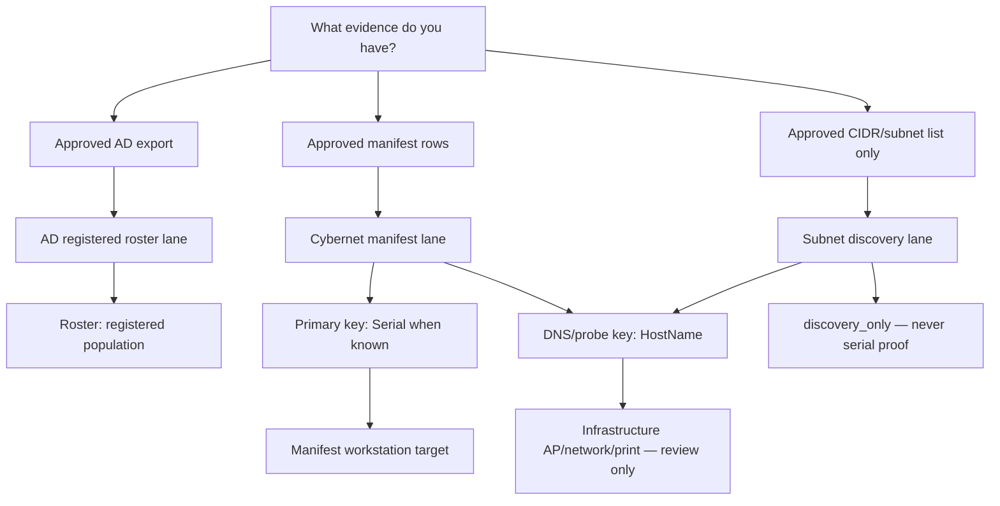

# Survey Lanes — Technician Map

This document is the canonical map for **which survey job you are running** and **which identifier key to use at each step**. It complements serial-first and subnet-inference doctrine without changing low-noise survey discipline.

## Two orthogonal axes

| Axis | Question | Values |
|------|----------|--------|
| **Survey lane** | What job am I doing? | AD registered roster lane · Cybernet manifest lane · Subnet discovery lane |
| **Identifier lane** | What key am I using right now? | Serial · HostName · MAC |

DNS and probes may also report a **device role** (workstation vs access point vs network gear vs printer). Infrastructure findings are expected in subnet discovery; they are informational, not product failures.

## When to use each survey lane

### AD registered roster lane

Use when you have an **approved AD computer export** and your goal is to build the registered-device population for dashboard review.

| Item | Detail |
|------|--------|
| Population authority | AD registered computer accounts |
| Typical entry | `survey/sas-export-ad-registered-population.sh` |
| Identity proof | None by itself — AD is roster evidence, not reachability or serial proof |
| Output paths | `survey/output/ad_registered_population/`, `ad_registered_normalized.csv`, AD bucket CSVs |

AD is the roster. Network probes are attendance. WMI/endpoint inventory is identity proof.

### Cybernet manifest lane

Use when you have **AD export or approved manifest rows** and your goal is **serial-confirmed workstation survey**.

| Item | Detail |
|------|--------|
| Population authority | AD export / approved manifest |
| Typical entry | Dashboard **Start Cybernet Survey** or `survey/sas-survey-targets.sh` |
| Identity proof | **Serial-first** — hostname is a probe transport hint; MAC supports correlation only |
| Output paths | `survey/output/cybernet_dns_resolution_report.csv`, merged evidence CSVs |

See also: [`CYBERNET_SERIAL_FIRST_SURVEY.md`](CYBERNET_SERIAL_FIRST_SURVEY.md)

### Subnet discovery lane

Use when you have **approved CIDR/subnet lists** and your goal is **find what is on the wire / infer location context**. Access points and other infrastructure are expected.

| Item | Detail |
|------|--------|
| Population authority | Approved CIDR/subnet list only — not AD population |
| Typical entry | `survey/sas-cybernet-subnet-survey.sh` modes (`local-context-only` → `dns-list-only` → `discover` → …) |
| Identity proof | Hostname/IP/MAC are **location/routing evidence** — never serial proof |
| Output paths | `survey/output/cybernet_subnet_survey/`, `dns_infrastructure_classification.csv` |

See also: [`CYBERNET_SUBNET_LOCATION_INFERENCE.md`](CYBERNET_SUBNET_LOCATION_INFERENCE.md)

## Identifier choice table

| Key | Use when | Never use for |
|-----|----------|---------------|
| **Serial** | Manifest row has known serial; privileged identity collection | Subnet-only discovery proof |
| **HostName** | DNS resolution, probe transport, manifest hint | Serial proof without privileged identity |
| **MAC** | DHCP/Nmap correlation, supporting evidence | Serial proof |

## Decision tree

## Device roles (classifier output)

The shared classifier (`survey/sas-survey-device-classify.py`) labels probe findings:

| DeviceRole | Counts toward Cybernet population? |
|------------|--------------------------------------|
| `target_workstation` | Yes (manifest lane, in manifest) |
| `infrastructure_access_point` | No |
| `infrastructure_network` | No |
| `infrastructure_print` | No |
| `discovery_only` | No |
| `infrastructure_unknown` | No |

Dashboard review separates **manifest targets**, **infrastructure discovered**, and **needs review** buckets.

## Dashboard classification review

When you load a survey classification CSV, the Cybernet review panel shows counts and row-level drill-down sections:

| Section | Meaning | Technician action |
|---------|---------|-------------------|
| **Cybernet Targets** | Rows classified as `target_workstation` or explicitly marked `CountsTowardCybernetPopulation=Yes` | Continue serial-first identity review and approved reachability checks |
| **Infrastructure** | Access points, network gear, printers, or unknown infrastructure-like rows | Keep visible for subnet/location context; do not count as Cybernet population |
| **Network / AP** | `infrastructure_access_point` and `infrastructure_network` rows | Validate site/subnet context if needed; do not treat as missing Cybernet workstations |
| **Printers** | `infrastructure_print` rows | Validate print queue or driver path separately from Cybernet workstation survey |
| **Needs Review** | Conflicts, discovery-only rows, infrastructure matches from manifest rows, or unknown low-confidence rows | Read the row's `Why` and `Next action`; collect approved identity evidence before changing target lists |

Each drill-down row exposes `SurveyLane`, `IdentifierType`, `DeviceRole`, `CountsTowardCybernetPopulation`, classifier signals, next action, and source file. The `Why` text translates classifier signals such as `reverse_dns:ap-pattern`, `hostname:cybernet-prefix`, and `port:9100` into field-readable explanations.

Infrastructure is separated because DNS and subnet discovery can legitimately surface access points, switches, routers, printers, and appliances. These findings are useful for location review but are not serial-confirmed Cybernet workstations.

## Export column set (classification completeness)

DNS resolution (`survey/sas-resolve-manifest-dns.py`), DNS-list classification (`survey/sas-classify-dns-list-output.py`), and Nmap evidence export (`survey/sas-nmap-evidence-export.py`) all emit the shared classifier columns:

| Column | Meaning |
|--------|---------|
| `SurveyLane` | `cybernet_manifest` or `subnet_discovery` |
| `IdentifierType` | `Serial`, `HostName`, or `MAC` — which key drove this row |
| `SurveyAuthority` | Whether serial, MAC, hostname fallback, or subnet inference is authoritative |
| `DeviceRole` | Workstation vs infrastructure vs discovery-only |
| `RoleConfidence` | `high`, `medium`, `low`, or `needs_review` for unresolved/ambiguous rows |
| `RoleSignals` | Semicolon-separated classifier signals (for example `nmap:no-hostname`, `manifest:no-hostname`) |
| `CountsTowardCybernetPopulation` | `Yes` only for confirmed manifest workstation targets |
| `NextAction` | Field-readable next step for the technician |

Nmap export also includes probe evidence columns (`Target`, `observed_hostname`, `observed_serial`, `observed_mac`, reachability/probe fields, `Notes`, `EvidenceSource`, `SourceFile`).

### Unresolved manifest rows (`NO_HOSTNAME`)

When a manifest row has serial, MAC, or identifier values but no hostname-like value, the DNS resolver emits `Status=NO_HOSTNAME` and classifies the row via `classify_from_unresolved_manifest_row()`:

- Serial-only rows → `target_workstation`, `RoleConfidence=needs_review`, population `Yes`
- MAC-only rows → `target_workstation`, `RoleConfidence=needs_review`, population `No` until hostname is confirmed
- Ambiguous identifier-only rows → `discovery_only`, `needs_review`, population `No`
- Empty identifier rows → `infrastructure_unknown`, `needs_review`, population `No`

IP-only Nmap rows (no reverse DNS hostname) receive `RoleConfidence=needs_review` and a `nmap:no-hostname` signal. Infrastructure rows (AP, network gear, printer) always keep `CountsTowardCybernetPopulation=No`.

## Field validation safety

Use approved target manifests or approved narrow subnet lists only. Keep survey scope narrow and transparent. Normal operating-system, network, endpoint-protection, or application telemetry may occur during local verification; do not attempt to suppress it. Do not broaden scans beyond approved scope. Do not use credentials unless explicitly authorized and appropriate for the identity check. Do not commit live operational evidence; keep outputs in ignored local paths such as `targets/local/`, `logs/targets/`, `survey/output/`, `survey/artifacts/`, or `logs/nmap/`.

## Related doctrine

- [`LOW_NOISE_SURVEY_DOCTRINE.md`](LOW_NOISE_SURVEY_DOCTRINE.md) — reachability validation only; AD defines population
- [`CYBERNET_HOSTNAME_VARIANT_DOCTRINE.md`](CYBERNET_HOSTNAME_VARIANT_DOCTRINE.md) — bounded hostname variant discovery
- [`DASHBOARD_ENTRYPOINT.md`](DASHBOARD_ENTRYPOINT.md) — field dashboard front door
- [`../START-HERE-CYBERNET-NEURON-SURVEY.md`](../START-HERE-CYBERNET-NEURON-SURVEY.md) — CLI orchestrator path
